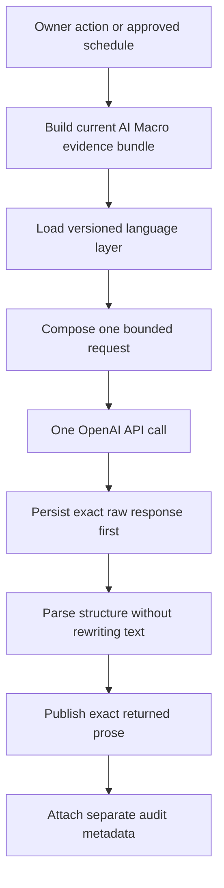
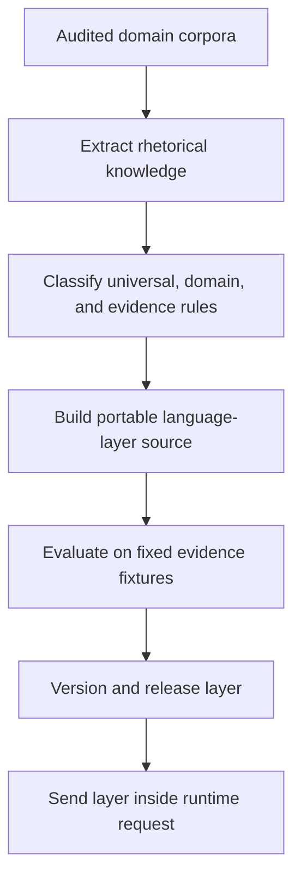

# AI Macro Language Layer — Mission-Confirmation Pipeline

**Status:** Proposed architecture for user approval  
**Date:** 2026-08-12  
**Authorization boundary:** This document does not authorize or perform the rebuild.

## 1. Mission

Build a portable, plug-and-play language layer that AI Macro sends **into one OpenAI generation request** alongside the platform's current evidence. The layer teaches OpenAI how to reason through and express that evidence with the desired voice, sophistication, cadence, domain fluency, and restraint.

OpenAI produces the Read. The language layer guides that production upstream; it never edits, rewrites, repairs, scores into a replacement, or otherwise alters OpenAI's returned prose downstream.

The runtime contract is:

> **AI Macro evidence + portable language layer + output contract → one authorized OpenAI call → exact returned prose is persisted and published**

## 2. Exact pipeline



### Stage 1 — Authorization

A generation begins only because:

- the owner explicitly invokes it; or
- an automation schedule previously configured and approved by the owner invokes it.

The language layer has no scheduling, automation, network, billing, or self-invocation authority.

### Stage 2 — Evidence preparation

AI Macro's deterministic platform builds the current evidence bundle for all eleven domains. This layer owns:

- facts and calculations;
- canonical display values;
- metric definitions;
- domain boundaries;
- evidence identifiers;
- source lineage;
- current snapshot identity.

The evidence bundle is the exclusive factual source for the generation. The academic language corpus never becomes a competing source of current facts.

### Stage 3 — Language-layer loading

The platform loads one versioned, human-auditable language-layer artifact. That artifact contains editorial intelligence only:

- universal voice and reasoning principles;
- domain-conditioned vocabulary and relationship structures;
- evidence-conditioned expression rules;
- a varied inventory of argument and sentence architectures;
- cross-domain Macro synthesis guidance;
- cadence and nonrepetition guidance;
- uncertainty, causal, null, heterogeneity, and limitation discipline;
- approved systems-reasoning lessons from the neuroscience layer with its analogy boundary;
- generalized anti-patterns learned from failed production prose.

The layer contains no live facts, provider access, API credentials, scheduling code, publication rules, retry rules, or post-generation rewrite logic.

### Stage 4 — Request composition

The request composer combines three independent inputs:

1. the current deterministic evidence bundle;
2. the versioned language layer;
3. the required Reader output contract.

The output contract requests one structured response containing:

- eleven domain Reads;
- one AI Macro Read;
- stable section identifiers;
- the exact headline and analysis text for each section;
- sentence-level evidence IDs when required for audit.

The language layer is clearly labeled as guidance, never evidence. The request instructs OpenAI to perform its own planning and editing internally before returning the answer, rather than exposing those activities as additional paid calls.

### Stage 5 — Single generation call

One authorized run makes exactly one OpenAI Responses API request.

- SDK retries: `0`.
- Validator-triggered calls: `0`.
- Repair calls: `0`.
- Replacement calls: `0`.
- Critic calls: `0`.
- Editor calls: `0`.
- Fallback generation calls: `0`.

The response is the product purchased by that run.

### Stage 6 — Response preservation

The platform persists the exact response before parsing, validation, or rendering. The record includes the response text or structured payload, response ID, model, token use, language-layer version, evidence snapshot ID, and generation time.

Nothing downstream may silently discard, replace, paraphrase, or overwrite that response.

### Stage 7 — Structure-only parsing

The renderer may extract fields or section boundaries from the returned schema, but it may not change the text inside them.

- If the structured response parses normally, the platform renders each returned string verbatim.
- If OpenAI returns usable prose with malformed structure, the platform preserves and displays the returned prose through a raw-response presentation path rather than hiding the paid output.
- If the API returns no response at all because of a transport or provider failure, the platform records that failure and makes no unauthorized second call; it cannot publish prose that OpenAI did not return.

Whitespace normalization required solely by the display framework must not change words, punctuation, sentence order, or meaning.

### Stage 8 — Publication

Every returned OpenAI generation is published as that run's new output. Publication does not depend on whether a style or semantic validator likes the response.

The platform does not:

- retain the prior Read in place of the new response;
- suppress a paid response;
- present a replacement response;
- tell the user that no new output exists when OpenAI returned one;
- trigger another call to improve a result.

### Stage 9 — Optional diagnostics

Post-response diagnostics may inspect grounding, schema conformance, repetition, cadence, or editorial quality only if they are kept completely separate from the prose.

Diagnostics may:

- annotate the run for the owner's review;
- support offline evaluation of future language-layer revisions;
- identify factual or stylistic defects.

Diagnostics may not:

- edit the output;
- block or delay publication;
- trigger another call;
- choose an older response;
- alter billing or automation;
- be mislabeled as proof that the prose is elegant.

## 3. Offline corpus-to-layer pipeline

The academic corpus is used before runtime, not after generation.



The rebuild must derive the layer from the corpus with traceable mappings. It must preserve more of the corpora's rhetorical range than the prior three-architecture profiles and must not reduce the research to a list of banned phrases.

The corpus-to-layer process should produce:

- a human-auditable source artifact;
- a machine-readable runtime artifact;
- explicit provenance from each production rule to admitted corpus observations;
- domain modules that can be added or replaced independently;
- a universal layer supported by cross-domain recurrence;
- evidence-conditioned rules that determine appropriate expression for ratios, queues, growth rates, nulls, comparisons, bottlenecks, heterogeneity, and uncertainty;
- a neuroscience systems module whose boundary prevents biological analogy from becoming economic evidence;
- evaluation fixtures and a release report.

## 4. Plug-and-play interface

The rebuilt product should have a narrow interface conceptually equivalent to:

```text
generate_read(
    evidence_bundle,
    language_layer,
    output_contract,
    authorized_request_config
) -> exact_openai_response
```

The language layer should be usable by any compatible AI Macro generation caller without importing publication, validation, automation, persistence, or provider logic. Replacing the layer should require changing a versioned artifact or its explicit configuration, not rewriting the platform.

## 5. Inside versus outside the language layer

| Inside the layer | Outside the layer |
|---|---|
| Voice and analytical grammar | Current facts and calculations |
| Domain vocabulary and relationship chains | Provider retrieval and retained data |
| Evidence-conditioned expression | Evidence selection and snapshot identity |
| Argument and sentence architecture range | API authorization and billing controls |
| Cadence and cross-section variety | Scheduling and automation |
| Uncertainty and causal discipline | Response persistence |
| Macro synthesis guidance | Parsing and Reader rendering |
| Anti-patterns and failure lessons | Publication decisions |
| Neuroscience-derived systems reasoning | Validators and diagnostics |

## 6. Non-negotiable acceptance conditions

The rebuild is correct only if all of the following are true:

1. The language product is a portable input supplied to OpenAI.
2. One authorized generation equals one API call.
3. OpenAI generates all eleven domain Reads and the AI Macro Read in that call.
4. The returned prose is persisted before downstream handling.
5. The published words are exactly the words OpenAI returned.
6. No deterministic component rewrites, patches, substitutes, or improves the prose.
7. No second model call edits, critiques, repairs, validates, or replaces the first.
8. Validators, if retained, are audit-only and cannot suppress publication or authorize spending.
9. A scheduled invocation is authorized when the owner has deliberately enabled and configured that schedule.
10. The rebuild does not change or disable automation unless the user separately authorizes automation work.
11. The corpus contributes language intelligence, never current factual claims.
12. Neuroscience contributes bounded systems reasoning and never empirical evidence about the AI economy.
13. Every returned paid response remains visible, including imperfect or structurally malformed responses that contain usable prose.
14. No exact-word blacklist is presented as a general language solution.
15. Evaluation occurs offline against fixed evidence fixtures and does not add runtime calls.

## 7. What will be removed or replaced after approval

The rebuild should replace the prior mission-misaligned commentary architecture, including:

- the domain draft call;
- the domain editor call;
- the domain critic call;
- the Macro draft call;
- the Macro editor call;
- the Macro critic call;
- comparative publication-gate logic;
- any validator-dependent output suppression;
- any recovery design whose purpose is to finish a multi-call editorial sequence.

Stage persistence, evidence identity, zero-retry controls, and audit provenance may be retained only where they serve the new one-call contract and do not alter or hide the response.

## 8. Approval statement

Approval of this document would mean the rebuild target is:

> A corpus-derived, versioned language-guidance package that is inserted into a single authorized OpenAI request with AI Macro's current evidence; OpenAI returns the complete Reader copy once; AI Macro persists and publishes that returned copy verbatim; all validation and evaluation remain non-mutating, non-blocking, and non-billing.

No production rebuild begins until the user confirms that this is the intended mission.
